# 📚 Organización de Migraciones por Módulos

Este directorio contiene todas las migraciones del proyecto organizadas en **batches por módulos funcionales**, lo que facilita el mantenimiento, escalabilidad y comprensión del esquema de base de datos.

## 🗂️ Estructura de Módulos

Las migraciones están organizadas en 15 módulos independientes que se ejecutan en orden específico respetando sus dependencias:

### Batch 01: Sistema Base
**Dependencias:** Ninguna  
**Descripción:** Tablas fundamentales del sistema Laravel
```
- users
- password_reset_tokens
- personal_access_tokens
- failed_jobs
- jobs
- logins
```

### Batch 02: Permisos
**Dependencias:** Sistema Base  
**Descripción:** Sistema de permisos y roles (Spatie Laravel Permission)
```
- permissions
- roles
- model_has_permissions
- model_has_roles
- role_has_permissions
```

### Batch 03: Ubicaciones
**Dependencias:** Sistema Base  
**Descripción:** Estructura geográfica y organizacional
```
- pais
- departamentos
- municipios
- regionals
- centro_formacions
- sedes
```

### Batch 04: Personas
**Dependencias:** Sistema Base, Ubicaciones  
**Descripción:** Información personal de todos los usuarios del sistema
```
- personas (con campos de ubicación y auditoría)
```

### Batch 05: Infraestructura
**Dependencias:** Ubicaciones  
**Descripción:** Estructura física de las instalaciones
```
- bloques
- pisos
- ambientes
```

### Batch 06: Programas
**Dependencias:** Sistema Base  
**Descripción:** Programas de formación y redes de conocimiento
```
- red_conocimientos
- programas_formacion
```

### Batch 07: Instructores y Aprendices
**Dependencias:** Personas, Ubicaciones  
**Descripción:** Actores principales del sistema educativo
```
- instructors
- aprendices
- vigilantes
```

### Batch 08: Fichas
**Dependencias:** Programas, Instructores/Aprendices, Ubicaciones  
**Descripción:** Fichas de caracterización de programas
```
- fichas_caracterizacion
```

### Batch 09: Relaciones
**Dependencias:** Instructores/Aprendices, Fichas, Infraestructura  
**Descripción:** Tablas pivot que conectan entidades
```
- aprendiz_ficha_caracterizacion
- instructor_ficha_caracterizacion
- ambiente_ficha
- ambiente_instructor_ficha
```

### Batch 10: Jornadas y Horarios
**Dependencias:** Fichas, Relaciones  
**Descripción:** Gestión de horarios y días de formación
```
- jornadas_formacion
- ficha_caracterizacion_dias_formacion
- instructor_ficha_dias
```

### Batch 11: Asistencias
**Dependencias:** Relaciones, Jornadas/Horarios  
**Descripción:** Control de asistencias y registros de entrada/salida
```
- asistencia_aprendices
- entrada_salidas
```

### Batch 12: Competencias
**Dependencias:** Programas  
**Descripción:** Competencias, resultados de aprendizaje y guías
```
- competencias
- resultados_aprendizajes
- guia_aprendizajes
- guia_aprendizaje_rap
```

### Batch 13: Evidencias
**Dependencias:** Competencias, Instructores/Aprendices  
**Descripción:** Evidencias de aprendizaje
```
- evidencias
```

### Batch 14: Logs y Auditoría
**Dependencias:** Instructores/Aprendices, Fichas  
**Descripción:** Registro de cambios y auditoría
```
- asignacion_instructor_logs
```

### Batch 15: Parámetros
**Dependencias:** Sistema Base  
**Descripción:** Configuración y parámetros del sistema
```
- parametros
- temas
```

## 🚀 Uso del Sistema de Módulos

### Comandos Disponibles

#### Listar todos los módulos
```bash
php artisan migrate:module --list
```

#### Migrar un módulo específico
```bash
php artisan migrate:module batch_01_sistema_base
php artisan migrate:module batch_02_permisos
```

#### Migrar todos los módulos en orden
```bash
php artisan migrate:module --all
```

#### Resetear y migrar todo desde cero
```bash
php artisan migrate:module --all --fresh
```

#### Migrar usando el comando nativo de Laravel
```bash
php artisan migrate --path=database/migrations/batch_01_sistema_base
```

### Migración Completa del Sistema

Para una instalación limpia desde cero, ejecuta:

```bash
php artisan migrate:module --all --fresh
```

Este comando:
1. Limpia la base de datos (`migrate:fresh`)
2. Ejecuta cada batch en orden respetando las dependencias
3. Muestra el progreso en tiempo real
4. Se detiene si hay algún error

## 📝 Convenciones de Nomenclatura

### Timestamps
Todas las migraciones usan el formato: `2025_10_27_NNNNNN_descripcion.php`
- `2025_10_27`: Fecha de reorganización
- `NNNNNN`: Número secuencial dentro del batch (000001, 000002, etc.)

### Nombres de Archivos
- `create_[tabla]_table.php`: Crear una nueva tabla
- `add_[campo]_to_[tabla]_table.php`: Agregar campos a una tabla existente
- `remove_[campo]_from_[tabla]_table.php`: Eliminar campos
- `drop_[tabla]_table.php`: Eliminar una tabla
- `update_[campo]_of_table_[tabla].php`: Modificar campos existentes

## 🔗 Dependencias Entre Módulos

```mermaid
graph TD
    A[Batch 01: Sistema Base] --> B[Batch 02: Permisos]
    A --> C[Batch 03: Ubicaciones]
    A --> F[Batch 06: Programas]
    A --> O[Batch 15: Parámetros]
    
    C --> D[Batch 04: Personas]
    C --> E[Batch 05: Infraestructura]
    C --> G[Batch 07: Instructores/Aprendices]
    
    D --> G
    F --> G
    
    G --> H[Batch 08: Fichas]
    E --> I[Batch 09: Relaciones]
    H --> I
    
    I --> J[Batch 10: Jornadas/Horarios]
    J --> K[Batch 11: Asistencias]
    
    F --> L[Batch 12: Competencias]
    L --> M[Batch 13: Evidencias]
    G --> M
    
    H --> N[Batch 14: Logs]
    G --> N
```



## ⚠️ Consideraciones Importantes

### Orden de Ejecución
**SIEMPRE** respeta el orden de los batches (01, 02, 03...) ya que las dependencias entre tablas están diseñadas en ese orden.

### Foreign Keys
Las claves foráneas se crean usando `foreignId()->constrained('tabla')` solo cuando la tabla referenciada ya existe en un batch anterior.

### Rollback
Para revertir cambios:
```bash
# Revertir el último batch completo
php artisan migrate:rollback

# Revertir un módulo específico (requiere que sea el último migrado)
php artisan migrate:rollback --path=database/migrations/batch_15_parametros
```

### Testing
Para tests, usa:
```bash
php artisan migrate:fresh --env=testing
```

## 📋 Checklist para Nuevas Migraciones

Cuando agregues una nueva migración:

1. ✅ Identifica a qué módulo funcional pertenece
2. ✅ Verifica las dependencias de tablas
3. ✅ Coloca el archivo en el batch correcto
4. ✅ Usa el timestamp secuencial correcto (siguiente disponible en el batch)
5. ✅ Actualiza el archivo `migrations_batches.php` si es necesario
6. ✅ Documenta cambios significativos en este README
7. ✅ Prueba la migración aislada y en conjunto

## 🛠️ Mantenimiento

### Agregar un Nuevo Módulo

1. Crea la carpeta: `database/migrations/batch_XX_nombre_modulo/`
2. Agrega las migraciones con timestamps secuenciales
3. Actualiza `migrations_batches.php`
4. Actualiza `app/Console/Commands/MigrateModule.php` (array `$modules`)
5. Documenta en este README

### Reordenar Migraciones

Si necesitas cambiar el orden:
1. Actualiza los timestamps manteniendo la secuencia
2. Verifica que no haya dependencias rotas
3. Prueba con `migrate:fresh` antes de commitear

## 📞 Soporte

Para problemas o dudas sobre la estructura de migraciones:
- Revisa el archivo `database/migrations_batches.php` para entender las dependencias
- Usa `php artisan migrate:module --list` para ver el estado de los módulos
- Consulta los logs en `storage/logs/laravel.log`

---

**Última actualización:** 27 de octubre de 2025  
**Versión:** 1.0  
**Total de migraciones:** 75 archivos organizados en 15 módulos

